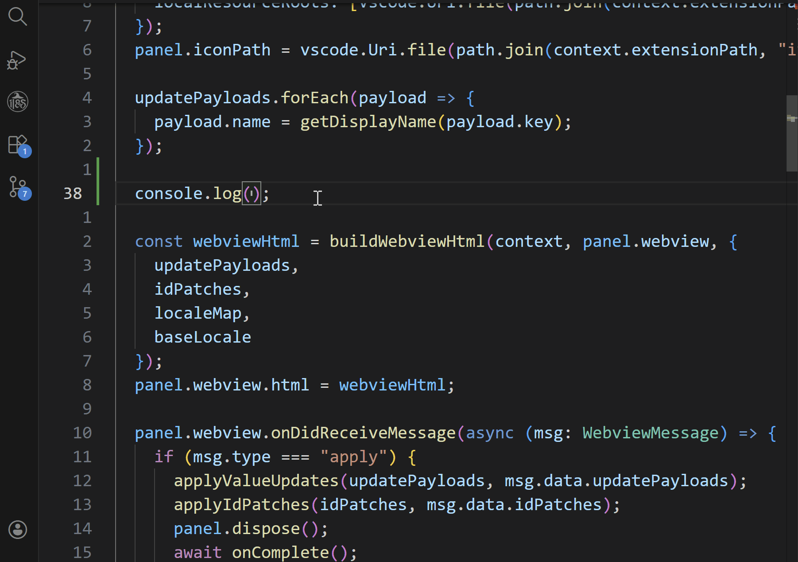

# Completion

## What It Does

Completion suggests translation keys and translated text when you type inside i18n function calls.

## How to Use

### Trigger Patterns

- `t('...')`
- `t("...")`
- ``t(`...`)``

### Typical Workflow

1. Type in an i18n call argument.
2. Choose a suggestion from completion list.
3. Confirm and insert the key.

## Related Settings

- `i18n-mage.completion.enable`
- `i18n-mage.completion.displayLanguageSource`
- `i18n-mage.completion.matchScope`
- `i18n-mage.completion.pinyinSearch`
- `i18n-mage.i18nFeatures.translationFunctionNames`

## Tips

- Chinese-heavy projects: `matchScope = both`, `pinyinSearch = both`.
- If suggestions are noisy: start with `matchScope = key`.

