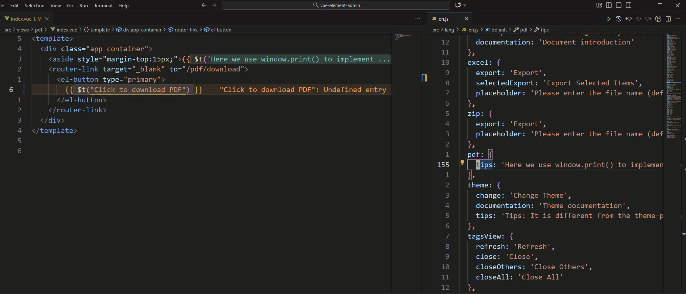

# Fix Undefined Entries

## What It Does

Undefined entries occur when code references text in `t(...)` but no matching key exists in locale files. This feature detects and fixes them in one flow.

## How to Use

### Entry Points

- Global fix:
  - Sidebar -> `Fix`
  - Command Palette -> `i18n Mage: Fix`
  - Shortcut: `Ctrl+Alt+F` / `Cmd+Alt+F`
- Scoped fix:
  - Usage panel -> Undefined Entries -> run fix on selected item/group
- Current-file fix:
  - Editor context menu -> undefined text extraction/fix

### Execution Flow

1. Detect undefined keys.
2. Match existing keys first.
3. Generate new keys for unmatched texts.
4. Translate new keys (optional).
5. Replace source code usage.
6. Preview and apply changes.

## Related Settings

- `i18n-mage.translationServices.referenceLanguage`
- `i18n-mage.translationServices.matchExistingKey`
- `i18n-mage.translationServices.autoTranslateMissingKey`
- `i18n-mage.translationServices.ignorePossibleVariables`
- `i18n-mage.translationServices.validateLanguageBeforeTranslate`
- `i18n-mage.translationServices.unmatchedLanguageAction`
- `i18n-mage.translationServices.keyGenerationFillScope`
- `i18n-mage.writeRules.keyStyle`
- `i18n-mage.writeRules.keyStrategy`
- `i18n-mage.writeRules.keyPrefix`
- `i18n-mage.writeRules.maxKeyLength`
- `i18n-mage.writeRules.stopWords`
- `i18n-mage.general.previewChanges`

## Tips

- Enable `matchExistingKey` to reduce duplicate keys.
- Keep preview enabled for safer large-batch refactoring.

