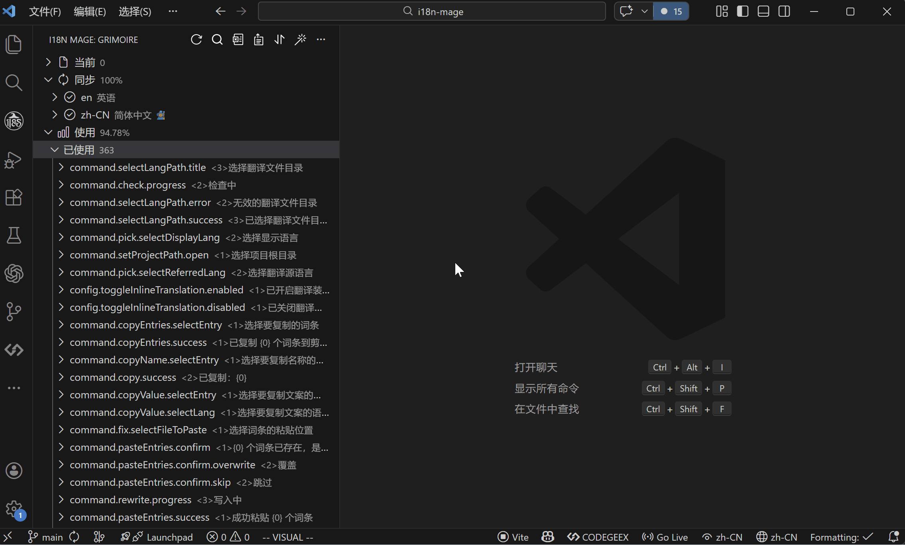

# Search Entries

## What It Does

Search helps you locate translation keys or translated text quickly in the entry tree.

## How to Use

### Entry Points

- Sidebar (`Grimoire`) -> `Search`
- Command Palette -> `i18n Mage: Search`
- Shortcut:
  - Windows / Linux: `Ctrl+Alt+S`
  - macOS: `Cmd+Alt+S`

### Search Controls

- Exit search mode: `Esc`
- Toggle whole-word match: `Alt+W`
- Toggle case-sensitive match: `Alt+C`

`Alt+W` and `Alt+C` are active only during search mode and can be combined.

## Related Settings

- `i18n-mage.general.displayLanguage` (affects default text candidates in search input)

## Tips

- For precise key lookup, enable whole-word match first.
- If terminology casing matters, also enable case-sensitive mode.

