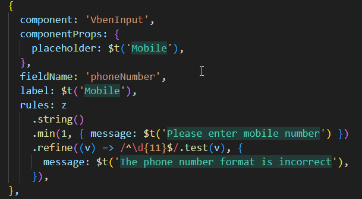

# Translation Hints

## What It Does

Translation hints render translated text directly in the editor, reducing context switching between source code and locale files.

## How to Use

### Entry Points

- Shortcut:
  - Windows / Linux: `Ctrl+Alt+D`
  - macOS: `Cmd+Alt+D`
- Settings: enable `i18n-mage.translationHints.enable`

### Typical Workflow

1. Enable translation hints.
2. Open files containing i18n calls.
3. Adjust display behavior (mode, scope, styles) to match project size.

## Related Settings

- `i18n-mage.translationHints.enable`
- `i18n-mage.translationHints.displayMode` (`overlay` / `inline`)
- `i18n-mage.translationHints.decorationScope` (`visible` / `file`)
- `i18n-mage.translationHints.realtimeVisibleRangeUpdate`
- `i18n-mage.translationHints.applyToStringLiterals`
- `i18n-mage.translationHints.enableLooseKeyMatch`
- `i18n-mage.translationHints.maxLength`
- `i18n-mage.translationHints.italic`
- `i18n-mage.translationHints.light.*`
- `i18n-mage.translationHints.dark.*`

## Tips

- Large projects: prefer `decorationScope = visible`.
- If hints are too dense: reduce `maxLength` and disable `applyToStringLiterals`.
- If dynamic keys are common: enable `enableLooseKeyMatch` and manually verify results.

