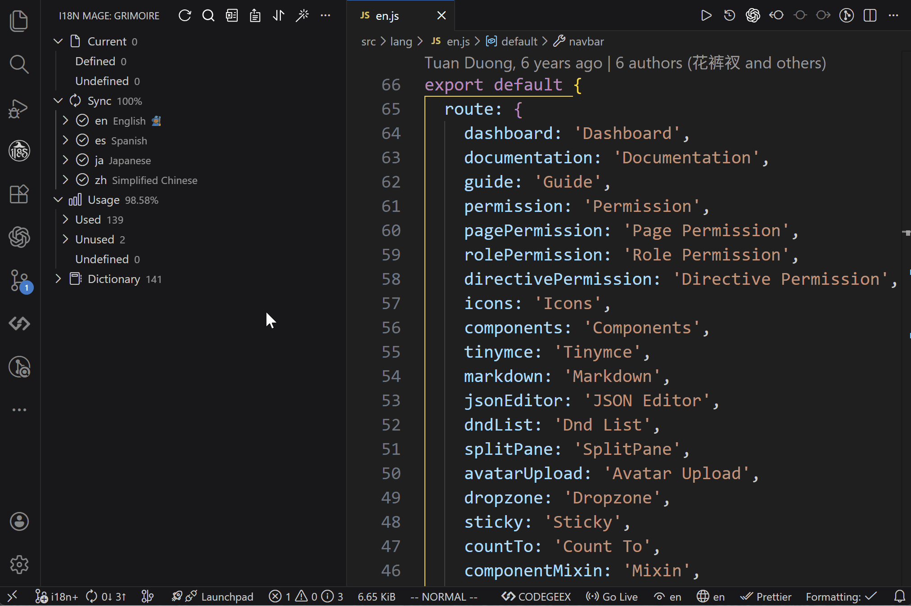

# Write Sorting

## What It Does

Write sorting keeps translation key order stable in locale files, reducing noisy diffs and improving reviews.

## How to Use

### Entry Points

- Sidebar (`Grimoire`) -> `Sort`
- Command Palette -> `i18n Mage: Sort`

### Sort Modes

- `none`
- `byKey`
- `byPosition` (flat locale structure only)

### Auto Sort After Fix

- `sortAfterFix = true`: sort automatically after `Fix`
- `sortAfterFix = false`: sort only when manually triggered

## Related Settings

- `i18n-mage.writeRules.sortRule`
- `i18n-mage.writeRules.sortAfterFix`
- `i18n-mage.writeRules.languageStructure`

## Tips

- Use `byKey` for stable deterministic output across teams.
- Use `byPosition` when you want key order aligned with source-code appearance.

