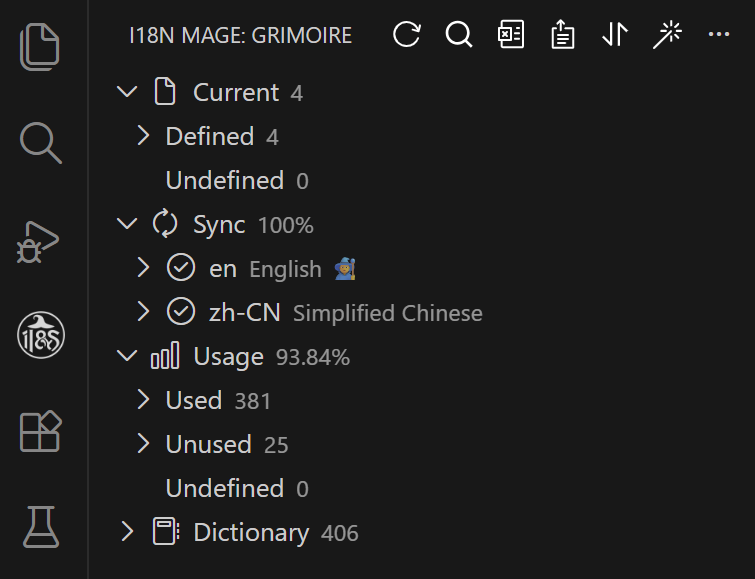
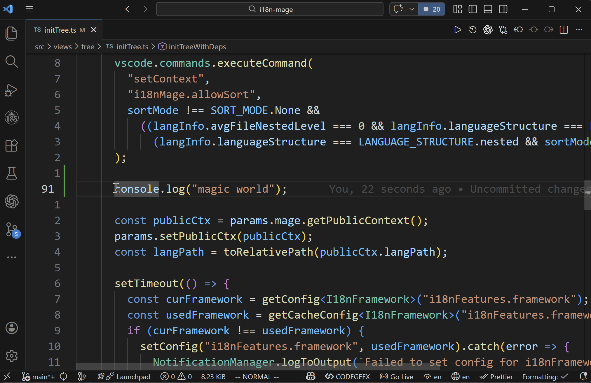
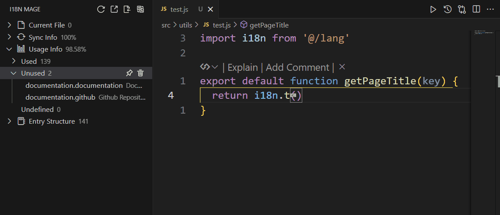
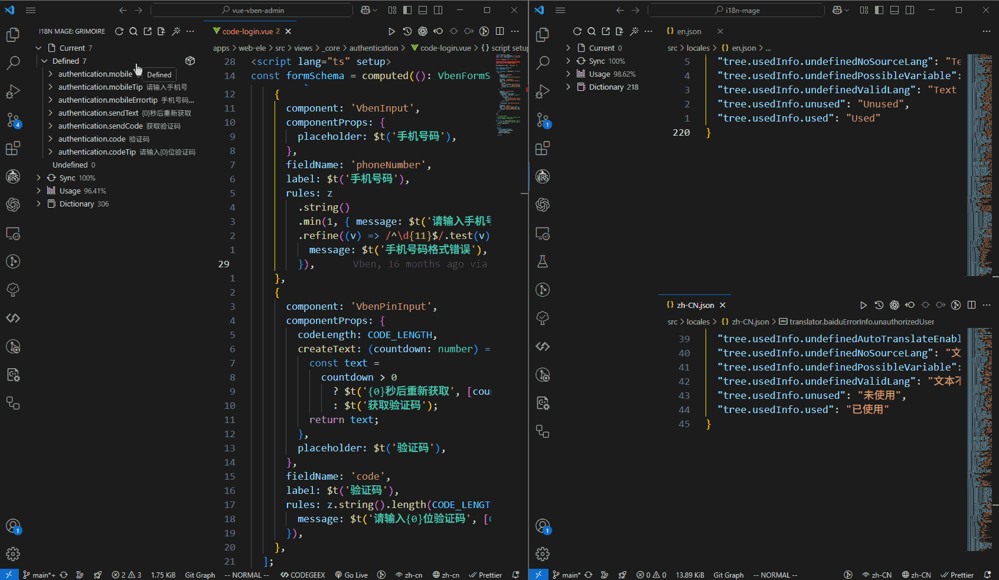

# i18n Mage - Frontend i18n Assistant

## Overview

`i18n Mage` is a VS Code extension for frontend internationalization workflows. It supports popular frameworks like Vue I18n and React I18next, and provides missing-translation fill, inline hints, key management, auto-completion, Excel import/export, and more.

## Core Features

### Translation Entry Overview
- Visualize all translation entries
- Keep language files in sync in real time
- Track entry usage statistics

### Inline Translation Hints
- Show translation text directly in code
- Customize style and color
- Toggle via shortcuts

See: [Translation Hints](/en/features/translation-hints)

### Smart Key Completion
- Auto-complete translation keys when writing i18n calls like `t("...")`
- Support matching by key, value, or both
- Optional pinyin and pinyin-initial matching for Chinese source text
- Improve multilingual development efficiency

See: [Completion](/en/features/completion)

### Fill Missing Translations
- Integrates global providers (DeepL, Google, OpenAI/ChatGPT) and optional regional providers (DeepSeek, Baidu, Tencent, Youdao)
- Fill missing translations automatically with preview and manual review

See: [Fill Missing Translations](/en/features/fill-missing-translations)

### Fix Undefined Entries
- Detect undefined entries
- Match existing entries or extract text into new entries
- Support customizable key naming strategies

See: [Fix Undefined Entries](/en/features/fix-undefined-entries)

### Extract Hardcoded Texts
- Scan hardcoded texts and batch-extract them into i18n keys
- Replace source code and write back into language files
- Preview before apply, suitable for migrating legacy projects

See: [Extract Hardcoded Texts](/en/features/extract-hardcoded-texts)

### Check Unused Entries
- Analyze global usage
- Support dynamic key pattern matching
- Manually mark or batch-delete unused entries

See: [Check Usage](/en/features/check-usage)

### Multilingual Text Search
- Search across languages to locate target entries quickly
- Support whole-word and case-sensitive search

See: [Search](/en/features/search)

### Excel Import/Export
- Export entries to Excel for translation teams
- Import translations from Excel and write back automatically
- Export git-based diff sheets (ADD/MODIFY/DELETE)
- Import diff sheets back into project

See: [Excel Import/Export](/en/features/excel)

### Cross-Project Entry Migration
- Copy entries by file or prefix into clipboard
- Paste copied entries into target projects for fast migration

See: [Quick Operations](/en/features/quick-operations)

### Write Sorting
- Sort by key name or first occurrence position
- Reduce noisy diffs after fixes

See: [Write Sorting](/en/features/write-sorting)

## Related Links

- [Report Issues](https://github.com/baimohui/i18n-mage/issues)
- [Source Code](https://github.com/baimohui/i18n-mage)
- [VS Code Marketplace](https://marketplace.visualstudio.com/items?itemName=jensen-wen.i18n-mage)
- [Open VSX](https://open-vsx.org/extension/jensen-wen/i18n-mage)

