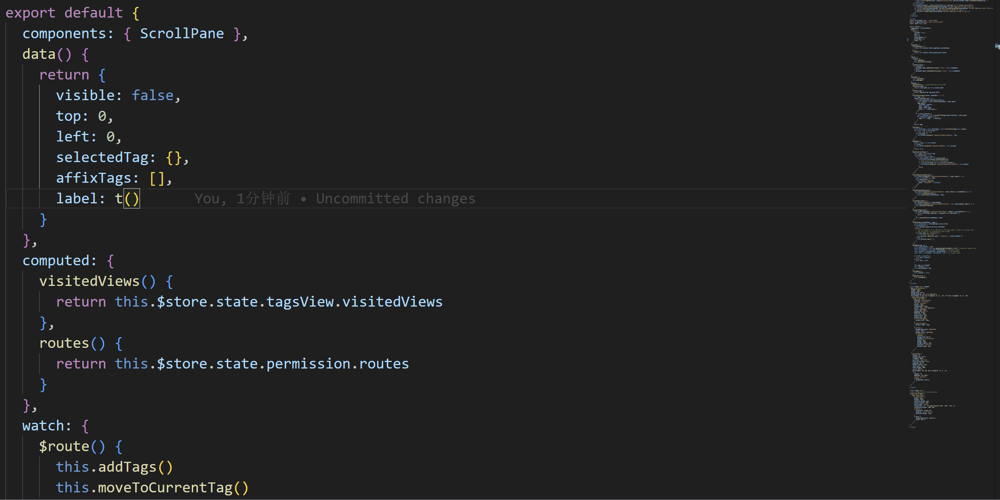

# ⚡ 代码补全

## 功能作用

代码补全会在你输入国际化函数参数时，自动提示可用 key 与对应翻译文案，减少手写错误并提升录入速度。

支持语言：
- JavaScript / TypeScript
- JSX / TSX
- Vue

## 如何触发

当你在国际化函数调用中输入引号内容时，插件会给出补全候选。  
例如：`t('...')`、`t("...")`

说明：
- 补全基于你配置的函数名列表（默认包含 `t`）
- 代码补全功能本身没有独立快捷键，使用编辑器默认补全交互（如方向键/回车确认）

## 常用配置

- `i18n-mage.completion.enable`  
  总开关，控制是否启用补全。

- `i18n-mage.completion.displayLanguageSource`  
  候选项文案来源：
  - `source`：显示翻译源语言文案
  - `display`：显示当前显示语言文案

- `i18n-mage.completion.matchScope`  
  补全匹配范围：
  - `key`：仅按 key 匹配
  - `value`：仅按翻译文案匹配
  - `both`：同时匹配 key 与文案

- `i18n-mage.completion.pinyinSearch`  
  中文文案拼音搜索模式：
  - `off`：关闭
  - `full`：全拼
  - `abbr`：首字母
  - `both`：全拼 + 首字母

- `i18n-mage.i18nFeatures.translationFunctionNames`（重要）  
  指定哪些函数调用应触发 i18n 补全，例如：`["t", "i18n.t"]`。

## 使用建议

- 中文项目建议：
  - `matchScope = both`
  - `pinyinSearch = both`
- 候选项太多时：
  - 先改为 `matchScope = key`
  - 再按团队命名规范收敛 key 前缀
