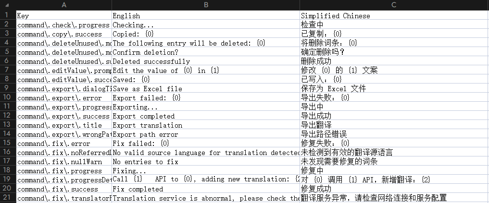

# 📊 Excel 同步

## 功能作用

Excel 同步用于在“语言文件”和“表格协作流程”之间来回切换，适合这些场景：

- 翻译团队集中在 Excel 中处理文案
- 开发团队需要批量导入/导出词条
- 版本迭代中只同步增量变更（Diff）

你可以使用 4 个操作：

- `导出翻译`（全量）
- `导入翻译`（全量）
- `导出版本差异`（增量）
- `导入版本差异`（增量）

## 使用入口

- 侧边栏（Grimoire）顶部点击 `Excel` 按钮
- 在弹出菜单中选择具体操作

说明：Excel 相关功能当前没有默认快捷键。

## 流程 A：全量导入导出

### A1. 导出 Excel（全量）

1. 选择 `Excel -> 导出 Excel`
2. 选择保存路径
3. 生成全量词条表格（`.xlsx`）

### A2. 导入 Excel（全量）

1. 选择 `Excel -> 导入 Excel`
2. 选择待导入文件
3. 选择导入模式：
   - `按 key 导入`
   - `按语言基线导入`
4. 若开启预览，会先展示变更，再确认写入

适用：项目初始化翻译、定期全量回灌。

## 流程 B：版本差异导入导出（推荐团队协作）

### B1. 导出版本差异

1. 选择 `Excel -> 导出版本差异`
2. 选择用于对比的 Git 基线提交
3. 生成差异 Excel，包含工作表：
   - `README`
   - `ADD`
   - `MODIFY`
   - `DELETE`

### B2. 导入版本差异

1. 选择 `Excel -> 导入版本差异`
2. 选择差异 Excel
3. 插件读取并应用可用更新
4. 若开启预览，会先进入变更确认界面

注意：

- 差异导入主要读取 `ADD` 与 `MODIFY`
- `DELETE` 主要用于信息提示，不会被自动执行删除
- 若某些 key 在当前项目已不存在，会被跳过并记录提示

适用：迭代中只同步新增/修改词条，减少全量表格来回传递成本。

## 相关配置

- `i18n-mage.general.sortOnExport`  
  控制导出顺序（`none` / `byKey` / `byPosition`）。

- `i18n-mage.general.previewChanges`  
  控制导入前是否展示预览，建议开启。

- `i18n-mage.workspace.projectPath`
- `i18n-mage.workspace.languagePath`  
  导出版本差异时，语言目录应位于项目目录内。

## 常见问题

- 为什么无法导出版本差异？  
  常见原因是语言目录不在项目目录内，或项目缺少可用于对比的 Git 提交历史。

- 导入版本差异后为什么有行没生效？  
  可能对应 key 在当前项目不存在，插件会自动跳过这些行。
