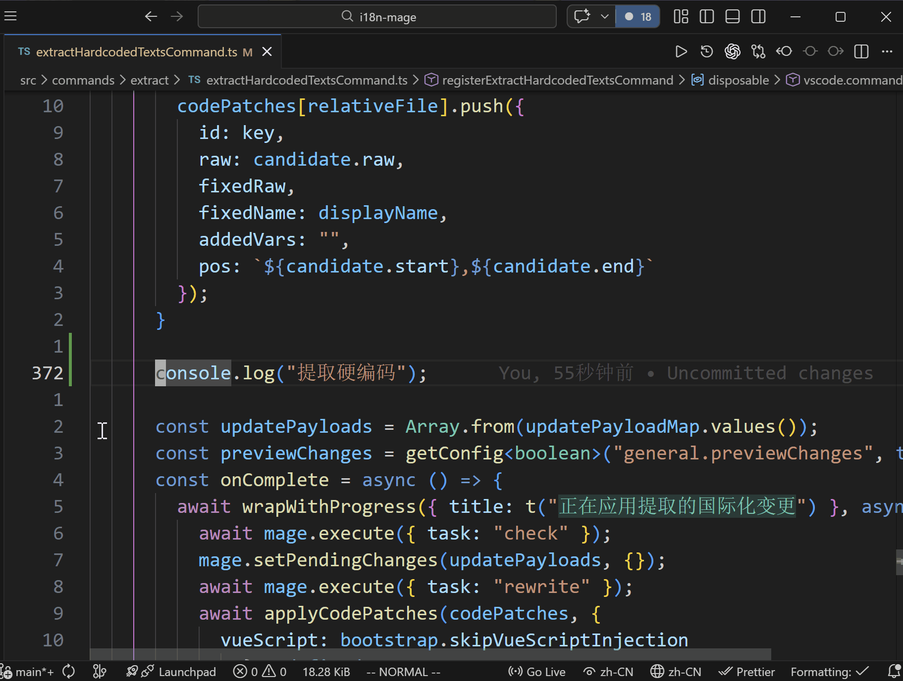

# 🛄 硬编码文案提取

## 功能介绍
用于把代码中的硬编码文本替换为 i18n 调用，并将新词条写入语言文件。

适用场景：
- 已国际化项目：补齐遗漏的硬编码文本。
- 未国际化项目：快速完成首轮国际化改造。

## 触发方式
- 侧边栏操作按钮：`提取硬编码文案`
- 编辑器右键菜单：`提取硬编码文案`
- 命令面板：`i18n Mage: Extract Hardcoded Text`
- 快捷键：
  - Windows / Linux：`Ctrl+Alt+E`
  - macOS：`Cmd+Alt+E`

## 使用流程
1. 打开提取向导，确认扫描范围、函数名、导入语句和提取规则。
2. 插件扫描候选硬编码文本。
3. 在预览中确认代码替换与词条写入。
4. 应用变更并同步更新代码和语言文件。

## 配置说明
- 提取相关配置请查看：`doc/config/extract-hardcoded-texts.md`
- 工作区路径与范围相关配置请查看：`doc/config/workspace-only.md`

## 常见问题
### 为什么有些文本没有被提取？
- 文件后缀不在 `i18n-mage.extract.fileExtensions` 中。
- 不在提取范围白名单中，或命中了提取范围黑名单。
- 文本命中过滤规则（如源语言过滤、模板属性过滤等）。

### 为什么提取后没有落盘变更？
- 在预览阶段取消了应用。
- 当前扫描没有可应用的候选项。

### 为什么导入或初始化代码没有按预期插入？
- 对应文件类型未配置 `import/setup` 语句。
- 相关函数名配置为空或与项目实际约定不一致。
