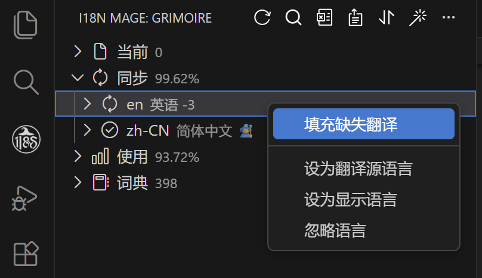
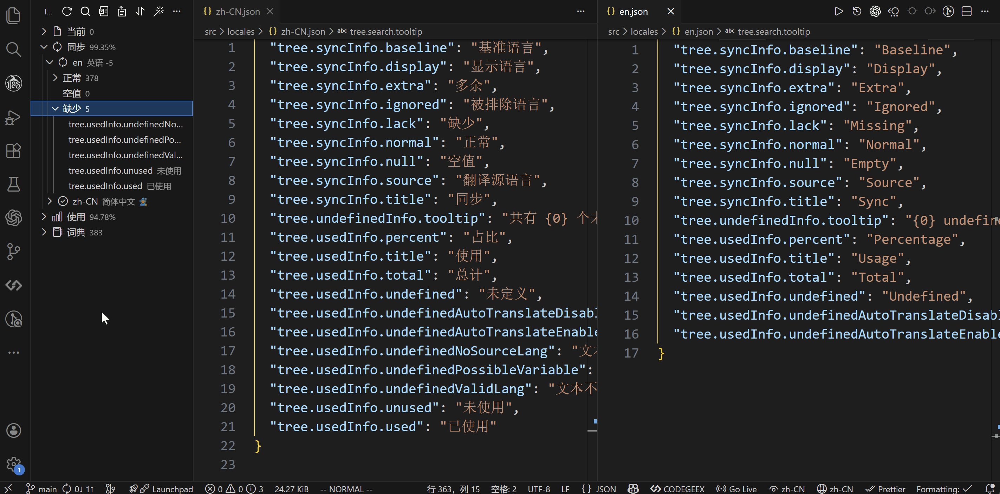

# 🌍 缺失翻译补充

## 功能作用

当某个词条在“翻译源语言”里有值，但在其他语言里缺失或为空时，i18n Mage 可以批量补全这些翻译内容。  
这个功能主要用于：

- 新增语言后的一次性补全
- 日常开发中持续补齐遗漏翻译
- 修复“缺失 + 空值”词条，保持多语言一致性

## 触发方式

### 方式一：全局补全（推荐）

- 点击侧边栏顶部 `修复`
- 或命令面板执行 `i18n Mage: Fix`
- 快捷键：
  - Windows / Linux: `Ctrl+Alt+F`
  - macOS: `Cmd+Alt+F`

说明：`Fix` 是组合能力，除了能够补充缺失翻译外，还支持修复未定义词条。其中缺失翻译部分会自动执行补全。

### 方式二：按范围补全

- 在树视图中，对某个“缺失/空值”分组或具体词条执行 `填充缺失翻译`
- 这种方式会只处理当前选中的范围（可限定到某个语言或某些 key）

## 开始前配置

### 1. 必要配置

- `i18n-mage.translationServices.referenceLanguage`  
  设置翻译源语言（补全时从该语言取原文）。

- `i18n-mage.translationServices.translateApiPriority`  
  设置翻译服务优先级，前面的服务失败会自动回退到下一个。

- 至少配置一个可用翻译服务密钥（按你使用的平台选择）：
  - `i18n-mage.translationServices.deeplApiKey`
  - `i18n-mage.translationServices.googleApiKey`
  - `i18n-mage.translationServices.openaiApiKey`
  - `i18n-mage.translationServices.deepseekApiKey`
  - `i18n-mage.translationServices.baiduAppId` + `i18n-mage.translationServices.baiduSecretKey`
  - `i18n-mage.translationServices.tencentSecretId` + `i18n-mage.translationServices.tencentSecretKey`
  - `i18n-mage.translationServices.youdaoAppId` + `i18n-mage.translationServices.youdaoAppKey`

### 2. 常用可选配置

- `i18n-mage.translationServices.autoTranslateEmptyKey`  
  开启后会把“空值词条”也纳入补全，不只处理“完全缺失”。

- `i18n-mage.translationServices.validateLanguageBeforeTranslate`  
  翻译前校验源文本语言，避免把非源语言文本当作源文本翻译。

- `i18n-mage.translationServices.unmatchedLanguageAction`  
  当语言校验失败时的处理策略：`ignore` / `force` / `fill` / `switch` / `query`。

- `i18n-mage.general.previewChanges`  
  是否在真正写入前展示预览，建议开启。

- `i18n-mage.translationServices.proxy.enable`、`proxy.host`、`proxy.port`、`proxy.protocol`  
  需要代理网络时启用。

- `i18n-mage.translationServices.aiCustomPrompt`  
  对 AI 翻译附加额外约束（术语、语气、品牌词等）。

## 实际执行流程

1. 插件先扫描缺失词条（若开启 `autoTranslateEmptyKey`，也会包含空值词条）。
2. 以 `referenceLanguage` 对应文案作为源文本。
3. 按 `translateApiPriority` 依次调用翻译服务。
4. 生成待写入变更（按语言、按 key）。
5. 若开启 `previewChanges`，先预览确认；确认后写入语言文件。

## 常见问题

- 为什么有些 key 没被补全？  
  常见原因是源语言本身没有值，或被你本次选择范围排除了。

- 为什么提示翻译失败？  
  通常是 API Key 无效、额度不足、网络不可达或该服务暂时异常。可调整 `translateApiPriority` 让插件自动切换到下一个服务。

- 为什么没有弹出预览？  
  检查 `i18n-mage.general.previewChanges` 是否关闭。
