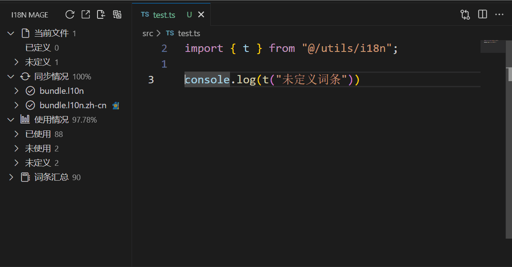

# 🛠 未定义词条修复

在开发多语言项目的过程中，常见的情况是：在代码里写了 `t('某中文文案')` 或者 `t('Some literal')`，但对应的翻译文件里并没有相应的 key 定义。这时就出现“未定义词条”的问题。i18n Mage 的“修复未定义词条”功能可以帮助你一键处理这些问题，使代码与翻译文件同步。

## ✨ 功能亮点

* **自动扫描未定义词条**：检测项目中所有 `t(...)` 或类似用法里，未在语言文件中定义的文本。
* **智能匹配已有词条**：若插件在已有词条中发现与文本内容一致或高度相似的条目，会优先建议使用已有 Key，避免重复定义。
* **自动生成 Key**：若没有匹配项，插件会根据设置的命名规则（如驼峰、下划线、路径形式等）生成新的 Key。
* **自动翻译并写入多语言文件**：对新生成的 Key，插件根据配置的翻译服务（如 DeepL、Google、百度、腾讯、OpenAI、DeepSeek 等）自动生成对应语言的译文并写入翻译文件。
* **代码替换**：将原本写在 `t('literal')` 中的文字替换成 `t('generated.key')`（或建议的 key），同步代码与翻译文件。
* **交互预览 & 审核**：在执行替换前，会弹出预览界面显示：原始文本、拟使用的 key、译文等，让用户确认或手动调整。
* **安全过滤**：自动排除变量、模板字符串、动态拼接、正则／脚本片段等不应被作为 literal 的部分，减少误操作。

## 👜 先决条件

### 1. 基础配置

**设置翻译源语言**  
- 在侧边栏的"同步信息"面板中，右键点击某个语言项，选择"设为翻译源语言"
- 或在设置中配置 `i18n-mage.translationServices.referenceLanguage`

**配置翻译服务**(如需自动翻译)
- 如果启用了自动翻译未定义词条，需要配置至少一个翻译服务的 API 密钥
- 支持的服务包括:DeepL、Google、OpenAI、DeepSeek、百度、腾讯、有道  

### 2. 功能开关配置

**启用匹配已存在的 key**  
- 配置 `i18n-mage.translationServices.matchExistingKey` 为 `true`
- 启用后，插件会优先在源语言文件中查找相同文本的已有词条  

**启用自动翻译未定义词条**  
- 配置 `i18n-mage.translationServices.autoTranslateMissingKey` 为 `true`
- 启用后，对于无法匹配已有词条的文本，插件会自动生成新 key 并调用翻译服务

### 3. Key 生成相关配置

**Key 命名风格**  
- 配置 `i18n-mage.writeRules.keyStyle` 来设置生成的 key 命名风格
- 支持：小驼峰 (camelCase)、大驼峰 (PascalCase)、下划线 (snake_case)、短横线 (kebab-case)、原样 (raw)  

**Key 生成策略**
- 配置 `i18n-mage.writeRules.keyStrategy` 来选择 key 名称生成方式
- `english`: 使用英文翻译作为 key 名称 (对非英文文本会调用翻译)  
- `pinyin`: 使用中文文本的拼音作为 key 名称  

**Key 前缀**  
- 配置 `i18n-mage.writeRules.keyPrefix` 来设置生成 key 的前缀
- 支持：无前缀、手动选择、使用项目中最常见的前缀

**Key 最大长度**  
- 配置 `i18n-mage.writeRules.maxKeyLength` 来限制生成 key 的最大长度
- 超长时会使用默认回退策略

**停用词列表**  
- 配置 `i18n-mage.writeRules.stopWords` 来设置生成 key 时需要剔除的停用词

### 4. 可选配置

**忽略可能的变量**  
- 启用 `i18n-mage.translationServices.ignorePossibleVariables` 可以自动忽略可能是变量名或编码值的词条
- 插件会过滤掉看起来像英文变量的文本  

**语言验证**  
- 启用 `i18n-mage.translationServices.validateLanguageBeforeTranslate` 可以在处理前验证文本是否属于源语言
- 配置 `i18n-mage.translationServices.unmatchedLanguageAction` 来设置验证失败时的处理方式  

**翻译填充范围**
- 配置 `i18n-mage.translationServices.keyGenerationFillScope` 来控制生成新 key 时的翻译范围
- `minimal`: 最小范围 - 拼音 key 只填充当前语言，英文 key 包含英文  
- `all`: 调用翻译服务为所有支持的语言生成翻译  

## 📋 使用流程

### 方式一：全局修复未定义词条

1. **触发修复命令**
   - 点击侧边栏顶部的"修复"按钮  
   - 或使用快捷键 `Ctrl+Alt+F` (Windows/Linux) / `Cmd+Alt+F` (Mac)  
   - 或在命令面板中执行 `i18n Mage: Fix`

2. **处理非源语言文本**(如果启用了语言验证)
   - 如果检测到非源语言的未定义文本，插件会根据 `unmatchedLanguageAction` 配置进行处理  
   - 如果设置为 `query`,会弹出选择框让您选择处理方式  

3. **选择写入位置**(多文件模式)
   - 如果项目使用多文件结构，插件会提示选择新词条的写入文件  
   - 插件会记住上次选择的文件，下次优先显示  

4. **选择 Key 前缀**(如果配置为手动选择)
   - 如果 `keyPrefix` 配置为 `manual-selection`,插件会提示选择或自定义前缀  
   - 可以从现有的常见前缀中选择，或输入自定义前缀  

5. **匹配已存在的词条**
   - 插件会在源语言文件中查找与未定义文本相同的已有词条  
   - 如果找到匹配，会直接替换为对应的 key，不会生成新词条

6. **生成新词条**
   - 对于无法匹配的文本，插件会根据配置生成新的 key  
   - 如果生成的 key 已存在或超长，会自动添加序号或优化长度  

7. **翻译新词条**(如果启用了自动翻译)
   - 插件会调用翻译服务为新词条生成翻译  
   - 根据 `keyGenerationFillScope` 配置决定翻译范围  

8. **预览和确认**(如果启用了预览)
   - 如果启用了 `i18n-mage.general.previewChanges`,会显示待应用的更改  
   - 包括源文件的修改和语言文件的新增词条

### 方式二：针对特定未定义词条修复

1. **在使用信息面板中操作**
   - 展开"使用信息"面板，找到"未定义词条"类别
   - 右键点击某个未定义词条或整个类别，选择"提取未定义文案"  

2. **修复执行**
   - 插件会仅处理选中的未定义词条  

### 方式三：在当前文件中修复

1. **在编辑器中右键**
   - 打开包含未定义词条的文件
   - 右键点击编辑器，选择"提取未定义文本"  

2. **修复执行**
   - 插件会处理当前文件中的所有未定义词条  
   - 通过 `fixQuery.genScope` 限定只处理当前文件

