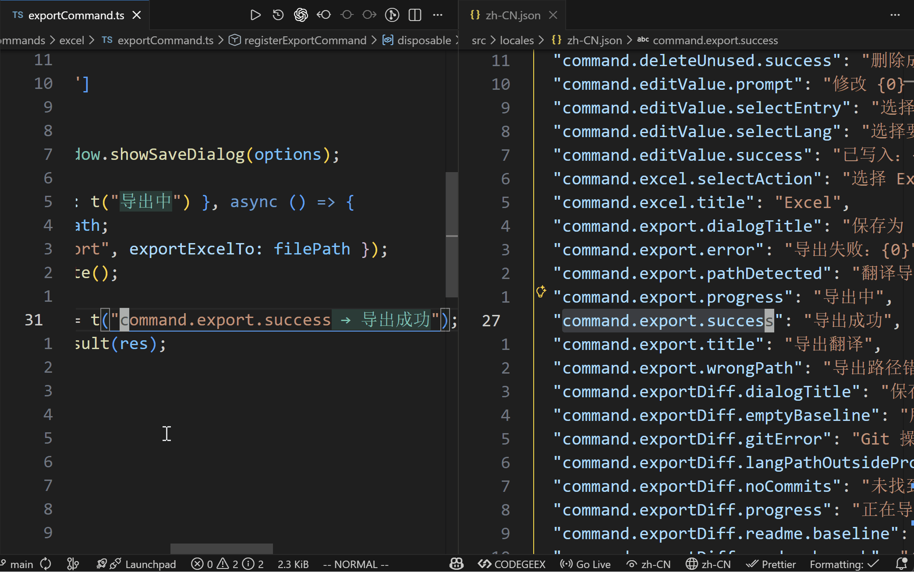
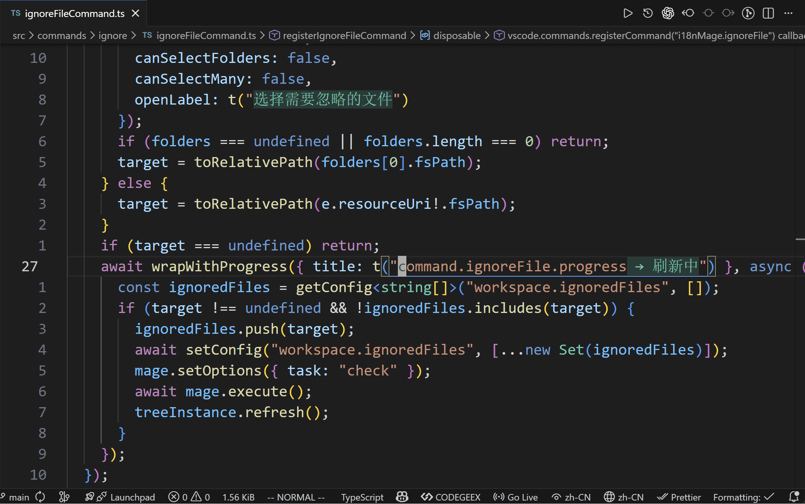
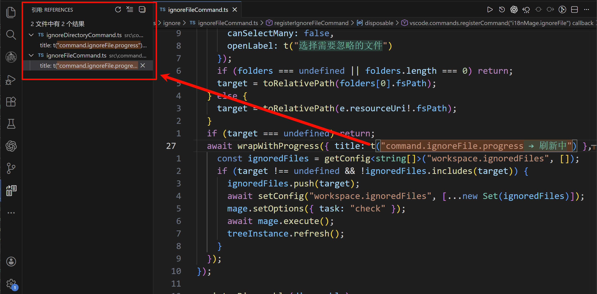
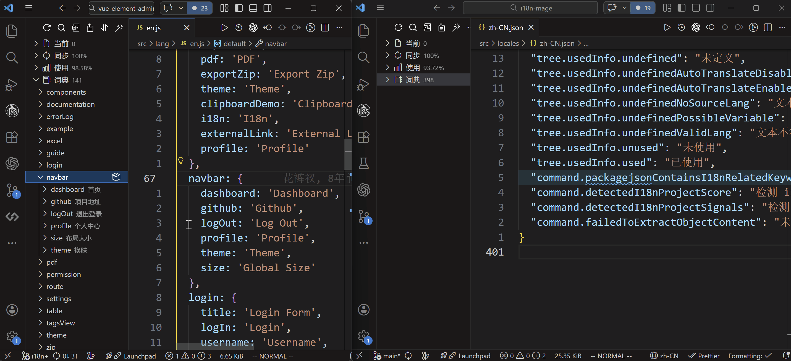
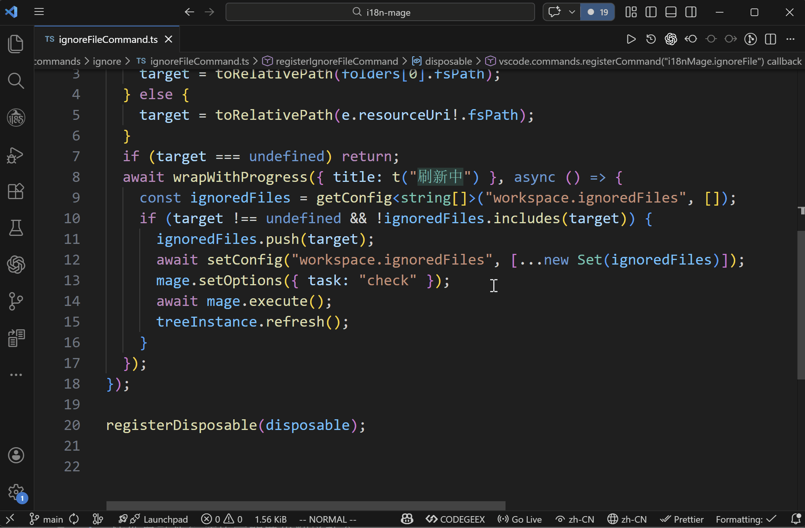
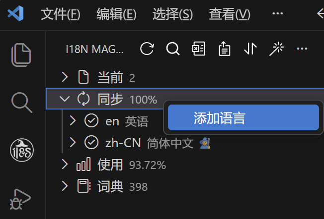

# 🚀 快捷操作

这篇文档汇总一些“使用频率高、但单点较轻量”的功能，方便你在日常开发中快速定位、修改和迁移词条。

## 重命名 key

适用场景：命名规范调整、语义升级、批量重构前的关键 key 修正。

操作方式：
1. 把光标放在代码中的 i18n key 上
2. 按 `F2`
3. 输入新 key 并确认

插件会自动检查冲突并同步写入。若 `i18n-mage.writeRules.sortAfterFix = true`，重命名后还会自动排序语言文件。

## 快速定位

- `F12`：用于确认“这个 key 在语言文件哪里定义”

- `Shift+Alt+F12`：用于查看“这个 key 在哪些文件被使用”

这两项适合在排查“未定义、误用、重复使用”时快速跳转定位。

## 跨项目迁移词条

适用场景：把项目 A 的一组词条迁移到项目 B。

推荐流程：
1. 在项目 A 使用 `复制词条`
2. 切换到项目 B，执行 `粘贴词条`
3. 若目标项目已存在同名 key，根据提示选择：
   - 覆盖
   - 跳过已存在项

注意：
- 粘贴内容使用 JSON 结构，建议不要手动破坏格式
- 若项目是多文件语言结构，插件可能会提示你选择写入文件

## 重写词条

适用场景：某个 key 的文案语义改变，需要整体重译。

操作方式：
1. 选中词条执行 `重写词条`
2. 选择源语言（默认优先参考语言）
3. 输入新的源文案
4. 插件会把新文案翻译到其他语言并写回

## 新增语言翻译

适用场景：项目刚加入一种新语言，希望尽快有可用翻译。

操作方式：
1. 在同步信息区域右键选择 `添加语言`
2. 选择目标语言
3. 设置该语言写入别名（如需要）
4. 插件自动执行该语言的缺失翻译补全

