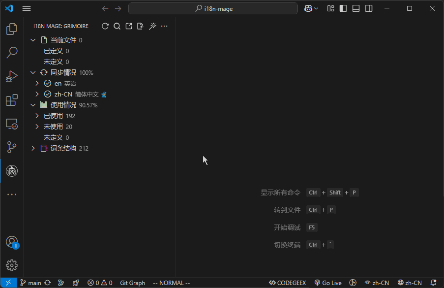

# 🔎 词条搜索

## 功能作用

词条搜索用于在 i18n 词条树中快速定位目标内容，支持按 key、翻译文案进行匹配，适合排查翻译、定位重复文案、快速跳转处理。

## 使用入口

- 侧边栏（Grimoire）顶部点击 `搜索`
- 命令面板执行 `i18n Mage: Search`
- 快捷键：
  - Windows / Linux: `Ctrl+Alt+S`
  - macOS: `Cmd+Alt+S`

输入框会优先使用以下默认值：
- 你在编辑器中选中的文本
- 或当前光标所在词条在“显示语言”下的文案
- 或上次搜索关键字

## 搜索中的常用操作

- 退出搜索：
  - `Esc`（仅在搜索模式且焦点在 Grimoire 视图时）
- 全词匹配开关：
  - `Alt+W`
- 大小写敏感开关：
  - `Alt+C`

说明：
- `Alt+W` / `Alt+C` 仅在“正在搜索”状态下生效
- 这两个开关可组合使用，缩小匹配范围

## 相关配置

搜索本身没有独立配置项，但会受以下设置影响：

- `i18n-mage.general.displayLanguage`（间接相关）  
  会影响搜索输入框可能带出的默认文案（来自显示语言）。

## 使用建议

- 想快速精确定位 key：先开 `Alt+W`（全词匹配）
- 需要区分术语大小写：再开 `Alt+C`（大小写敏感）
- 搜索结束后按 `Esc` 退出，恢复普通树视图
