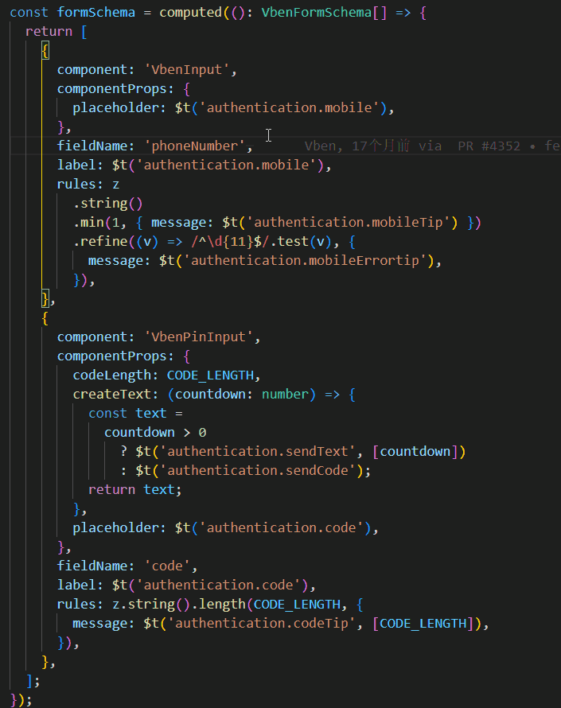

# 🏷️ 翻译装饰

## 功能作用

翻译装饰会在编辑器中直接显示词条对应的翻译文案，减少在“代码 - 语言文件”之间来回切换的成本。  
适合阅读旧代码、联调多语言页面、快速确认 key 是否写对。

## 使用方式

### 1. 快捷开关

- Windows / Linux: `Ctrl+Alt+D`
- macOS: `Cmd+Alt+D`

执行后会切换 `i18n-mage.translationHints.enable` 的开关状态。

### 2. 设置页开启

- 在配置中启用 `i18n-mage.translationHints.enable`
- 打开包含 i18n 调用的代码文件，即可看到装饰文本

## 常用配置说明

- `i18n-mage.translationHints.enable`  
  总开关，控制是否启用翻译装饰。

- `i18n-mage.translationHints.displayMode`  
  装饰显示方式：`overlay`（覆盖显示）或 `inline`（并行显示）。

- `i18n-mage.translationHints.fullFileMaxSizeKB`  
  装饰范围：根据文件大小智能切换装饰范围（≤设定值使用全文件装饰，否则仅在可见区域进行装饰。0 表示始终仅可见区域，-1 表示始终全文件）。

- `i18n-mage.translationHints.realtimeVisibleRangeUpdate`  
  在 `visible` 模式下滚动时是否实时更新装饰。开启后更实时，但可能增加 CPU 占用。

- `i18n-mage.translationHints.applyToStringLiterals`  
  是否把普通字符串也纳入装饰，而不仅限 i18n 函数调用。

- `i18n-mage.translationHints.enableLooseKeyMatch`  
  是否对动态 key（如模板字符串拼接）启用模糊匹配。开启后覆盖更广，但可能有误判。

- `i18n-mage.translationHints.maxLength`、`i18n-mage.translationHints.italic`  
  控制最大显示长度和字体样式。

- `i18n-mage.translationHints.light.*`、`i18n-mage.translationHints.dark.*`  
  分别配置浅色/深色主题下的前景色、背景色和透明度。

## 调整建议

- 大型项目优先用：`decorationScope = visible`
- 装饰太密集时：减小 `maxLength`，并关闭 `applyToStringLiterals`
- 动态 key 很多时：开启 `enableLooseKeyMatch`，并结合人工确认
