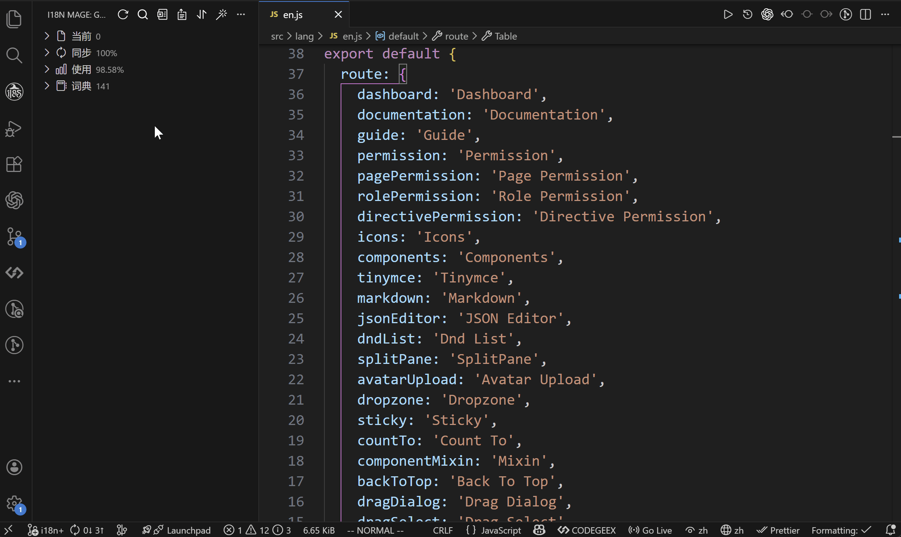

# 🔢 写入排序

## 功能作用

写入排序用于统一语言文件中词条的顺序，减少无意义 diff，方便协作和代码审查。

适用场景：
- 团队希望词条顺序稳定，避免每次提交顺序混乱
- 希望在修复完成后自动整理词条顺序
- 需要手动触发一次全量排序

## 使用入口

- 侧边栏（Grimoire）顶部点击 `排序`
- 命令面板执行 `i18n Mage: Sort`

说明：当前排序功能没有默认快捷键。

## 排序方式

由配置 `i18n-mage.writeRules.sortRule` 控制：

- `none`：不排序
- `byKey`：按 key 名字典序排序
- `byPosition`：按 key 在代码中首次出现位置排序

注意：
- `byPosition` 仅适用于“扁平结构”语言文件

## 自动排序

配置 `i18n-mage.writeRules.sortAfterFix`：

- `true`：执行 `Fix` 后自动再执行一次排序
- `false`：仅在你手动点击 `排序` 时排序

如果你希望每次修复后文件顺序都一致，建议开启此项。

## 相关配置

- `i18n-mage.writeRules.sortRule`
- `i18n-mage.writeRules.sortAfterFix`
- `i18n-mage.writeRules.languageStructure`（间接影响排序策略选择）
