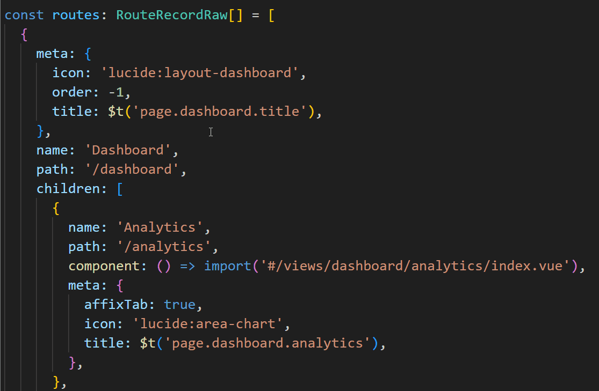
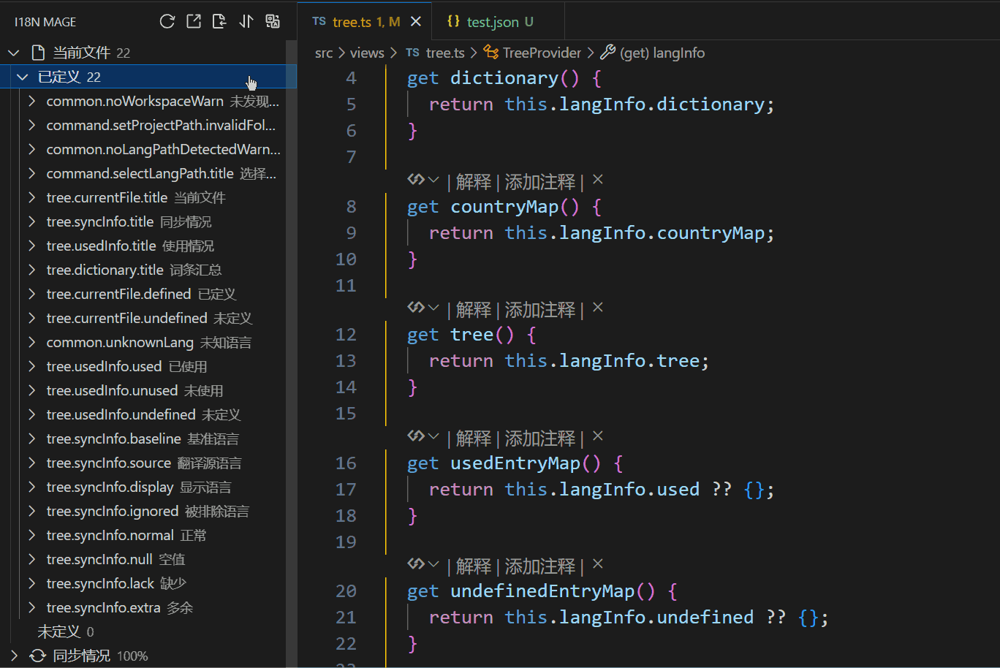

# 🪄 i18n Mage - 前端国际化助手 

<!--  -->

## 🌟 概述

`i18n Mage` 是一款专为前端开发者设计的 VS Code 插件，旨在全面提升国际化开发体验。它支持 Vue I18n、React I18next 等主流国际化框架，提供翻译补充、内联提示、词条管理、Key 自动补全、Excel 导入导出等一系列实用功能。

## ✨ 核心功能

### 🌳 翻译词条总览
- 可视化查看所有翻译词条
- 实时同步各语言文件状态
- 词条使用情况统计


### 🧠 翻译内联提示
- 在代码中直接显示实际翻译内容
- 可自定义样式和颜色
- 支持快捷键开关



### ⚡ 智能代码补全
* 在编写国际化函数（如 `t("...")`）时，自动联想已有翻译词条
* 支持按 key、value 或双向匹配进行候选筛选
* 支持中文拼音与首字母匹配，快速检索目标文案
* 自动填充词条 key，提高多语言开发效率


### 🚧 缺漏翻译补充
- 集成 DeepL、谷歌、百度、腾讯、有道、DeepSeek、ChatGPT 翻译服务
- 自动补充缺失翻译，支持预览与人工校验


### 🧩 未定义词条提取
- 智能识别未定义词条
- 自动匹配现有词条或提取文案生成新词条
- 支持自定义命名风格


### 🕵️ 未使用词条检测
- 全局分析词条使用情况
- 支持动态拼接 key 的模式匹配
- 可手动标记或批量删除未使用词条


### 🔍 全语种文案搜索
- 支持多语种文案搜索，快速定位目标词条
<!-- - 支持模糊匹配与正则表达式搜索 -->


### 📊 Excel 导入导出
- 将翻译词条导出为 Excel 文件，供翻译团队使用
- 从 Excel 导入翻译，自动写入语言文件


### 📋 复制词条数据
- 一键复制当前页词条键值对，便于模块迁移



## 🎉 感谢支持

如果这个插件对你带来了帮助，欢迎到 [GitHub 仓库](https://github.com/baimohui/i18n-mage) 点个 ⭐ 支持一下！

## 🔗 相关链接

- [🐛 报告问题](https://github.com/baimohui/i18n-mage/issues)
- [📦 源代码](https://github.com/baimohui/i18n-mage)
- [⭐ VS Code 市场](https://marketplace.visualstudio.com/items?itemName=jensen-wen.i18n-mage)
- [💜 Open VSX 市场](https://open-vsx.org/extension/jensen-wen/i18n-mage)

## 🤝 贡献指南

```bash
git clone https://github.com/baimohui/i18n-mage.git
cd i18n-mage
npm install
# f5 调试
npm run package
```

欢迎提交 issue 或 PR！
