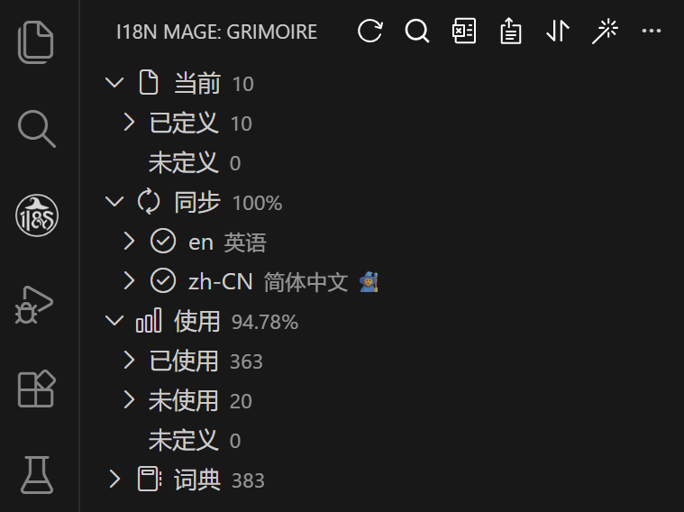

# 🚀 快速上手

本指南面向首次使用 i18n Mage 的用户，目标是让你在几分钟内完成可用配置并跑通核心流程。

## 1. 打开面板并确认项目状态

安装插件后，VS Code 侧边栏会出现 i18n Mage 图标。打开 `Grimoire` 面板后，你可以看到：

- 同步信息（语言状态、缺失/空值统计）
- 使用信息（已使用/未使用/未定义）
- 词条树与顶部操作按钮（搜索、Excel、排序、修复等）

## 2. 配置语言目录与项目目录

若插件未自动识别语言文件，请先配置：

- `i18n-mage.workspace.languagePath`：语言文件目录
- `i18n-mage.workspace.projectPath`：项目根目录

常见语言目录：`locales/`、`i18n/`、`lang/`。

## 3. 设置翻译源语言与显示语言

在“同步信息”区域中：

- 右键某语言可设为“翻译源语言”
- 右键某语言可设为“显示语言”

建议先明确翻译源语言，再使用修复、补全、重写等涉及翻译的功能。

## 4. 配置翻译服务（建议至少一个）

进入设置 `扩展 -> i18n Mage -> 翻译服务`，配置你使用的平台密钥。

常用项：

- `i18n-mage.translationServices.translateApiPriority`
- `i18n-mage.translationServices.deeplApiKey`
- `i18n-mage.translationServices.googleApiKey`
- `i18n-mage.translationServices.openaiApiKey`
- `i18n-mage.translationServices.deepseekApiKey`
- `i18n-mage.translationServices.baiduAppId` / `baiduSecretKey`
- `i18n-mage.translationServices.tencentSecretId` / `tencentSecretKey`
- `i18n-mage.translationServices.youdaoAppId` / `youdaoAppKey`

如需代理网络，配置：

- `i18n-mage.translationServices.proxy.enable`
- `i18n-mage.translationServices.proxy.host`
- `i18n-mage.translationServices.proxy.port`
- `i18n-mage.translationServices.proxy.protocol`

## 5. 跑通一个最小工作流

建议按这个顺序：

1. `Extract Hardcoded Texts`（`Ctrl+Alt+E` / `Cmd+Alt+E`，可选）  
   存量项目先提取硬编码文案，快速完成首轮国际化改造。
2. `Check Usage`（`Ctrl+Alt+C` / `Cmd+Alt+C`）  
   查看未定义、未使用、缺失翻译的现状。
3. `Fix`（`Ctrl+Alt+F` / `Cmd+Alt+F`）  
   一次处理未定义词条与缺失翻译。
4. `Search`（`Ctrl+Alt+S` / `Cmd+Alt+S`）  
   快速检索词条和文案，验证修复结果。
5. （可选）`Sort`  
   统一语言文件顺序，减少无意义 diff。

## 6. Excel 协作工作流（翻译团队常用）

在侧边栏点击 `Excel` 可看到 4 个操作：

- `导出 Excel`：导出全量词条
- `导入 Excel`：导入全量词条
- `导出版本差异`：按 Git 基线导出增量差异
- `导入版本差异`：将差异表回写到当前项目

推荐流程：

1. 开发侧 `导出版本差异`（选择基线提交）
2. 翻译侧在 `ADD / MODIFY` 工作表中处理文案
3. 开发侧 `导入版本差异` 并预览确认
4. 执行 `Check Usage` 复查结果

## 7. 常用快捷键速查

| 功能 | 快捷键（Win/Linux） | 快捷键（macOS） |
|---|---|---|
| 检测词条使用情况 | `Ctrl+Alt+C` | `Cmd+Alt+C` |
| 提取硬编码文案 | `Ctrl+Alt+E` | `Cmd+Alt+E` |
| 一键修复 | `Ctrl+Alt+F` | `Cmd+Alt+F` |
| 搜索词条 | `Ctrl+Alt+S` | `Cmd+Alt+S` |
| 切换翻译装饰 | `Ctrl+Alt+D` | `Cmd+Alt+D` |
| 浏览当前文件翻译 | `Ctrl+Alt+T` | `Cmd+Alt+T` |

