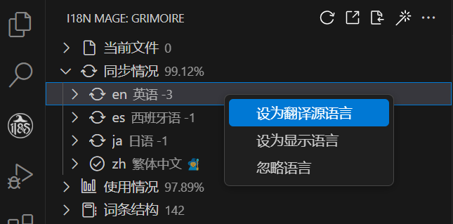

# 🚀️ 快速上手

安装 i18n Mage 后，按照以下步骤开始使用：

## 一、打开 i18n Mage 面板

启用插件后，VS Code 侧边栏会新增一个“国际化巫师”图标。点击后打开的面板会显示当前项目中的翻译词条信息，包括：

- 当前打开文件中的词条情况
- 各语言文件的同步情况（总词条数、缺失数等）
- 词条使用情况（已使用、未使用、未定义）
- 翻译词条的树状结构
- 功能按钮（刷新、导出、导入、排序、修复等）

如果 i18n Mage 没有自动检测到你的语言文件：

1. 在面板中点击"设置语言目录"
2. 选择包含语言文件的文件夹（例如：`locales/`, `i18n/`, `lang/`）

## 二、配置语言

- 在翻译面板中，“同步情况”区域会显示所有有效的语言文件名称。
- 可右键将某语言设置为“显示语言”或“翻译源语言”。
- 若插件无法识别文件语言，可手动标记语言类型。

## 三、配置翻译服务（推荐）

配置至少一个翻译服务以启用自动翻译：

1. 进入 `设置 > 扩展 > i18n Mage > 翻译服务`
2. 选择你偏好的服务：
   - **谷歌翻译**：无需配置，但可能需要代理
   - **DeepL**：需要 [API 密钥](https://www.deepl.com/pro#developer)
   - **百度翻译**：需要 [APP ID 和密钥](https://fanyi-api.baidu.com/)
   - **腾讯翻译**：需要 [SecretId 和 SecretKey](https://console.cloud.tencent.com/cam)
   - **DeepSeek**：需要 [API Key](https://platform.deepseek.com/)

## 四、更多配置

插件提供超过 70 项配置项，主要分为以下几类：

- 通用设置（启用插件、显示语言等）
- 国际化框架支持（翻译函数名、命名空间、插值样式等）
- 翻译服务（密钥、翻译源语言、启用未定义词条修复等）
- 检查规则（扫描文件、启用自动分析等）
- 写入规则（key 风格、引号样式、缩进等）
- 内联提示样式（颜色、最大展示字符数等）
- 自动补全（补全规则等）
- 工作区配置（项目路径、忽略目录、忽略语言文件等）

📌 可通过 VS Code 设置面板统一管理，也支持 `.vscode/settings.json` 中单独配置。

📘 全部配置项请参阅 [完整配置文档](../config/general.md)

## 五、命令与快捷键

| 命令 ID                            | 功能说明           | 快捷键     |
| ---------------------------------- | ------------------ | ---------- |
| `i18nMage.check`                   | 检测词条信息       | Ctrl+Alt+C |
| `i18nMage.fix`                     | 一键修复           | Ctrl+Alt+F |
| `i18nMage.toggleInlineTranslation` | 切换翻译内联提示   | Ctrl+Alt+D |
| `i18nMage.browseTranslationsInFile`| 速览当前文件翻译   | Ctrl+Alt+T |
| `i18nMage.goToDefinition`          | 跳转到词条源文件位置 | f12       |
| -                                  | 重构键名          | f2         |
| `i18nMage.export`                  | 导出词条为 Excel   | -          |
| `i18nMage.import`                  | 从 Excel 导入词条  | -          |
| `i18nMage.sort`                    | 对语言文件词条排序 | -          |
| ...                                | ...                | ...        |

> 💡 全部命令可通过命令面板（Ctrl+Shift+P）调用。